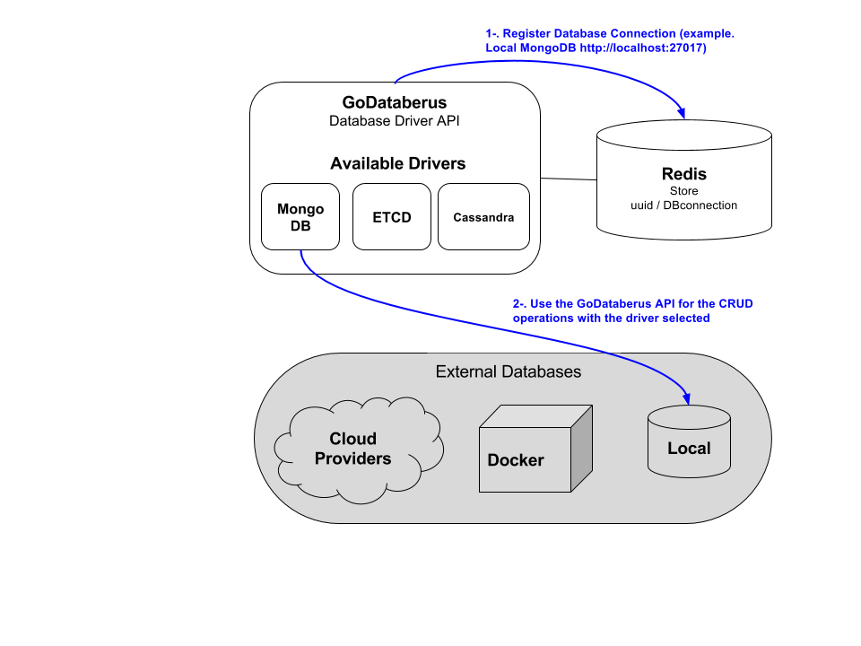

[](https://travis-ci.org/SwatLabs/GoDataberus)

# GoDataberus

GoDataberus is a "Database Driver API" in order to reduce the complexity of the CRUD operations in some common databases.
The idea is to use Databerus in order to connect to a external DB (using an available DB driver) using the same API independently of the database  

# Architecture

GoDataberus has been developed in Golang and contains:
 - Connection Redis store: Redis to store the database's connection data. It return an uuid to use in the following api calls. The connection data could be a local database, external cloud provider, or whatever.
 - GoDataberus go package: API to use the basic CRUD with the common databases. It based on different drivers for the databases and implements the basic functions for these databases.



# How to use GoDataberus
## API Definition

| Endpoint     | Method     | Description |
| :------------- | :------------- | :------------- |
| ```/v0/connections/{dbType}``` | PUT | Register a new Database connection entry. Return uuid to use in the following calls to this database |
| ```/v0/databerus/{dbType}/resources/{uuid}``` | PUT | Insert an item in the database associated to the uuid |
| ```/v0/databerus/{dbType}/resources/{uuid}/fields/{field}/items/{item}``` | GET | Search for an item in the database associated to the uuid |
| ```/v0/databerus/{dbType}/resources/{uuid}/exists/{field}/items/{item}``` | GET | Return True if an item exists in the database associated to the uuid |

## Available DB Backend connections

By now, the drivers available are:
- **MongoDB (dbType: mongo)**

    Example:
    
    `'{
       	"DBconnection":
       		{		"DbProto":"http",
       				"DbIpaddress":"localhost",
       				"DbPort":"27017",
       				"DbName":"Databerus",
       			    "DbUsername":"",		
       			    "DbPassword":"",		
       			    "DbCollection":"Test"
       	    }
       	}' `
- **ETCD (dbType: etcd)**
   
   Example:
   
   ``

## Register a Database Backend connection

First of all, you have to register the information to connect to an external database:

```
curl --request PUT \
  --url http://localhost:8080/v0/connections/mongo \
  --header 'content-type: application/json' \
  --data '{
  	"DBconnection":
  		{		"DbProto":"http",
  				"DbIpaddress":"localhost",
  				"DbPort":"27017",
  				"DbName":"Databerus",
  			    "DbUsername":"",		
  			    "DbPassword":"",		
  			    "DbCollection":"Test"
  	    }
  	}' 
```

Output:

```
"6edaa6e0-454e-11e7-88fa-3c15c2d66294"
```  

For instance, we are going to use the driver "mongo" with a local Database, so we use the "mongo" driver,
and the connection data to use a local database. 
It return an uuid that will be use in the next calls in order to use this connection to the database.

## Use the Backend with basic CRUD operations

### Insert Item 
```
curl --request PUT \
  --url http://localhost:8080/v0/databerus/mongo/resources/6edaa6e0-454e-11e7-88fa-3c15c2d66294 \
  --header 'content-type: application/json' \
  --data '{
  	"data":
  		{
  			"foo":"bar",
  			"foo2":"bar2",		
  			"set":
  					{			
  					"pass1":"password"
  					}
  		}
  		}'
```
### Get Item
```
curl --request GET \
  --url http://localhost:8080/v0/databerus/mongo/resources/6edaa6e0-454e-11e7-88fa-3c15c2d66294/fields/foo/items/bar \
```


# Build Dockerfile

```
TODO
```

# Run container

```
TODO
```

